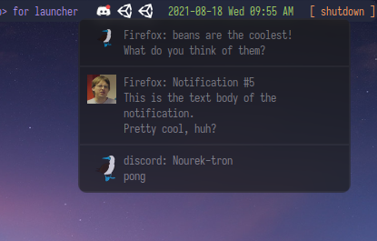

# Dotfiles_V2
To install see [SETUP.md](SETUP.md)

 

 
WM: Qtile
 
Font: Iosevka
 
Colorscheme: TokyoNight
 
Terminal: Kitty
 
Editor: NeoVim
 
Browser: Firefox
 
Launcher:Rofi
 
Notifications: Dunst
